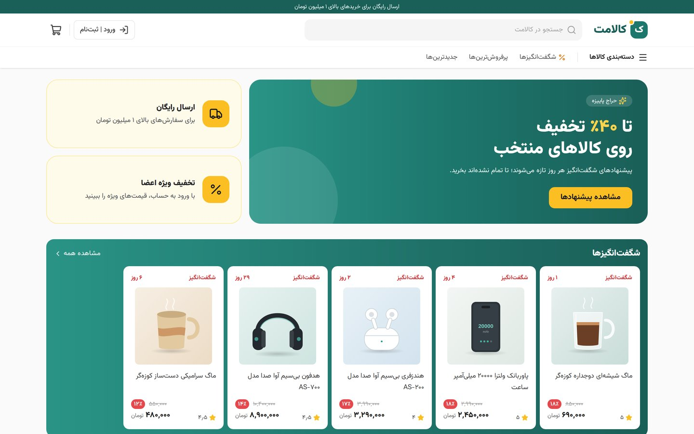
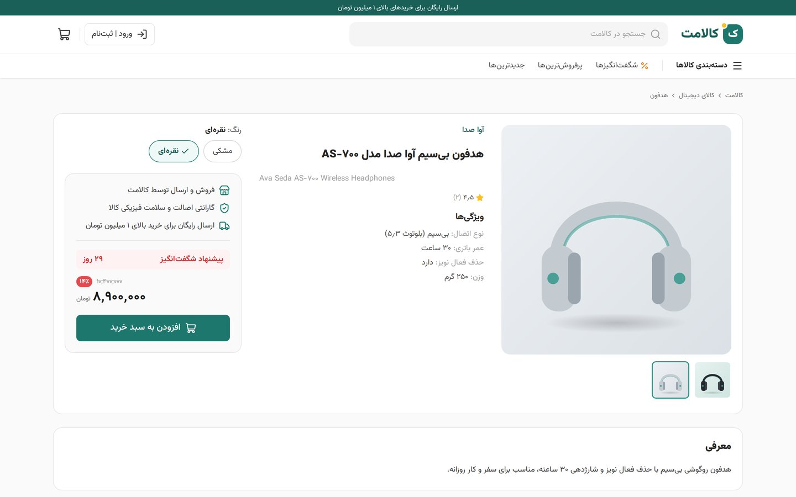
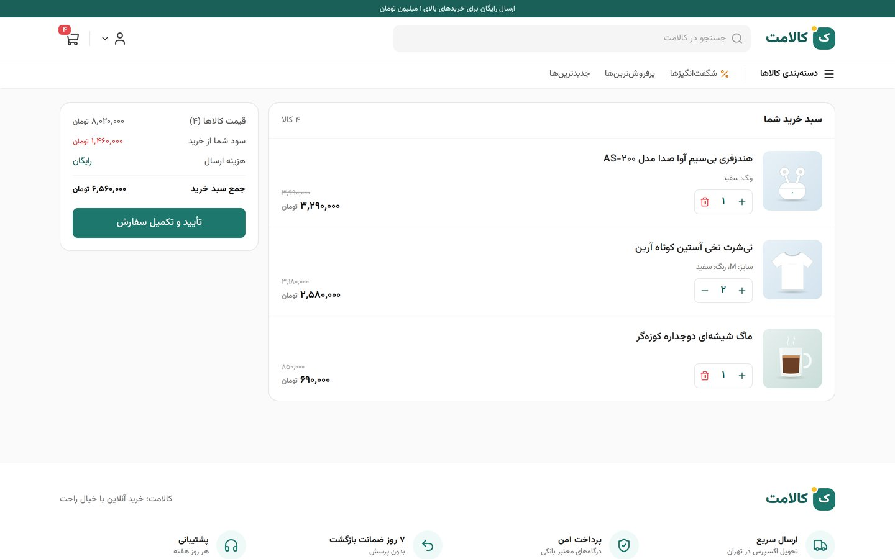
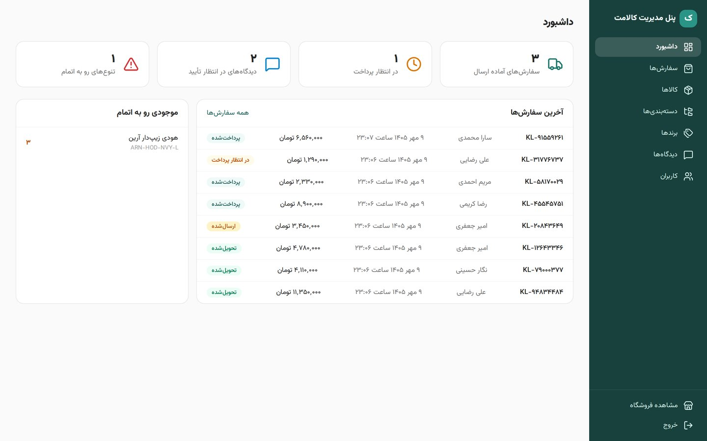
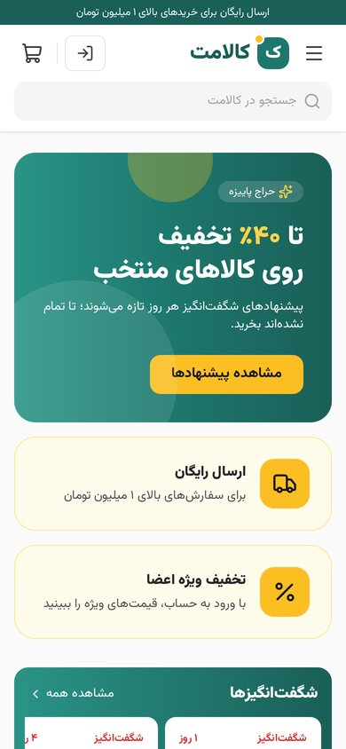
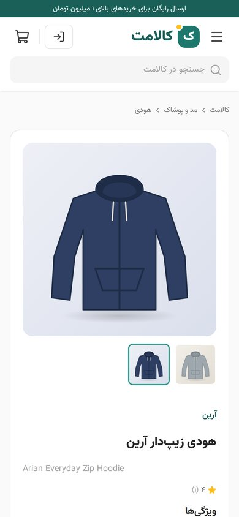

# Kalamet

A Persian (RTL) e-commerce store in the style of large Iranian marketplaces, built as a
full-stack portfolio project.

| Part | Stack | Status |
| --- | --- | --- |
| `backend/` | Java 21, Spring Boot 4, Spring Data JPA, Spring Security (JWT), Flyway, PostgreSQL 16 | Complete REST API |
| `frontend/` | Next.js 16, React 19, TypeScript, Tailwind CSS 4, TanStack Query | Store, customer account and admin panel |

## Screenshots

| Store | Product page |
| --- | --- |
|  |  |
| **Cart** | **Admin dashboard** |
|  |  |

<p>
  
  
</p>

The demo catalog's product pictures are illustrations made for this project
(`frontend/public/demo/`).

## What the backend does

- Sign-in with a mobile number and an SMS code (Kavenegar), short-lived JWT access tokens and
  rotating refresh tokens. No passwords.
- Catalog with categories, brands, products and their variants (colour, size...), specs, images,
  "amazing offers" with a countdown, Persian search and filters, and sorting by price, discount,
  rating or best-selling.
- A persistent cart at live prices, flat shipping that is free above a threshold, and a guest
  cart merge after sign-in.
- Checkout that reserves stock (optimistic locking, so the last unit is never sold twice), unpaid
  orders that expire after 30 minutes, and payment through Zarinpal or a built-in mock gateway.
- Moderated reviews with "verified purchase" badges and rating summaries.
- Admin endpoints for the catalog, stock, orders, reviews and users.
- Persian error messages with stable error codes, and Persian text normalisation (ی/ک, digits).

See [docs/api.md](docs/api.md) for the endpoints and [docs/database.md](docs/database.md) for
the schema.

## What the frontend does

- A Persian, right-to-left store: home page with amazing offers, category and search listings with
  filters and sorting kept in the URL, and product pages with colour/size pickers, specs and reviews.
- Prices in Toman, Persian digits and Jalali dates everywhere; the Vazirmatn font is self-hosted.
- Sign-in with an SMS code, a cart that works before sign-in and merges afterwards, checkout with
  saved addresses, payment through the gateway and a result page.
- Customer account: profile, orders (pay again, cancel), addresses and reviews.
- Admin panel: dashboard, orders (ship, deliver, refund), product editor with variants, stock,
  specs and images, categories, brands, review moderation and users.
- Tokens never reach browser JavaScript: the Next.js server keeps them in httpOnly cookies and
  forwards API calls (`/bff/...`), refreshing the session when needed.

## Run it locally

The quickest way runs everything in Docker (PostgreSQL, API and frontend):

```bash
docker compose --profile app up --build   # store on http://localhost:3000
```

Sign in with `09120000000` to get the admin panel at `/admin`; in this setup the login page shows
the code (demo mode), so no SMS is needed.

To work on the code, run the parts separately. Requirements: Java 21+ and Docker. Maven and
Node.js are not needed: the backend ships the Maven wrapper and the frontend runs in a Node 22
container.

```bash
docker compose up -d                              # PostgreSQL 16
cd backend && ./mvnw spring-boot:run              # API on http://localhost:8080; Flyway migrates on startup
docker compose --profile dev up frontend-dev      # Next.js dev server on http://localhost:3000
```

- API docs: <http://localhost:8080/swagger-ui.html>
- Sign in: `POST /api/auth/otp` with `{"mobile": "09120000000"}`. In development the code is
  printed in the backend log instead of sent by SMS. `09120000000` becomes an admin on sign-in
  (change it with `ADMIN_MOBILES`).
- Pay: the mock gateway is enabled in development; it shows a page with "pay" and "cancel"
  buttons and then redirects to the frontend at `FRONTEND_URL`.

Run the backend tests (they start their own PostgreSQL with Testcontainers, so Docker must be
running):

```bash
cd backend && ./mvnw test
```

End-to-end tests drive a real browser through the whole stack; see
[frontend/e2e/README.md](frontend/e2e/README.md).

## Configuration

Everything has a development default except where marked. Run with `SPRING_PROFILES_ACTIVE=prod`
in production: that profile leaves out the demo data, turns off the mock gateway and API docs,
and refuses to start without the required secrets.

| Variable | Default | Purpose |
| --- | --- | --- |
| `DB_HOST`, `DB_PORT`, `DB_NAME`, `DB_USER`, `DB_PASSWORD` | `localhost`, `5432`, `kalamet` ×3 | PostgreSQL connection. |
| `JWT_SECRET` | dev value; **required in prod** | HS256 signing key, at least 32 characters. |
| `OTP_HASH_SECRET` | dev value; **required in prod** | Key for hashing login codes, at least 16 characters. |
| `SMS_PROVIDER` | `LOG` (`KAVENEGAR` in prod) | `LOG` prints codes to the log. |
| `KAVENEGAR_API_KEY`, `KAVENEGAR_TEMPLATE` | -, `kalamet-login` | Kavenegar "verify lookup" API key and template (one `%token`). **Key required in prod.** |
| `OTP_DEMO_MODE` | `false` | Return the code in the API response, for a demo without SMS. |
| `ADMIN_MOBILES` | `09120000000` (empty in prod) | Comma-separated numbers that become admins on sign-in. |
| `ZARINPAL_MERCHANT_ID` | - (**required in prod**) | Zarinpal merchant id; without it only the mock gateway works. |
| `ZARINPAL_BASE_URL` | sandbox (production in prod) | `https://sandbox.zarinpal.com` or `https://payment.zarinpal.com`. |
| `PAYMENT_MOCK_ENABLED` | `true` (`false` in prod) | The mock gateway. |
| `PAYMENT_CALLBACK_URL` | derived from the request | Public URL of `/api/payments/callback`, if the API is behind a proxy that does not send `X-Forwarded-*` headers. |
| `FRONTEND_URL` | `http://localhost:3000` | Where customers land after paying (`/checkout/result`). |
| `CORS_ORIGINS` | `http://localhost:3000` | Comma-separated origins allowed to call the API. |

Shipping fee, free-shipping threshold, per-item limit, payment timeout and the login-code limits
(per number and per client IP) are in `backend/src/main/resources/application.yml` under
`kalamet.*`. Behind a reverse proxy, make sure it sets `X-Forwarded-For`, which the per-IP limit uses.

## Database

Migrations live in `backend/src/main/resources/db/migration`, one file per domain layer:

| File | Layer | Tables |
| --- | --- | --- |
| `V1__identity.sql` | Identity | users, otp_codes, provinces, addresses |
| `V2__catalog.sql` | Catalog | categories, brands, products, product_specs, product_variants, product_images |
| `V3__cart.sql` | Shopping cart | carts, cart_items |
| `V4__orders.sql` | Orders and payments | orders, order_items, payments |
| `V5__engagement.sql` | Engagement | reviews |
| `V6__refresh_tokens.sql` | Identity | refresh_tokens |

Conventions: money is stored as whole Rials (`BIGINT`) and shown as Toman in the UI; timestamps
are UTC (`TIMESTAMPTZ`) and shown in the Jalali calendar; customers sign in with a mobile number
and a one-time SMS code, so there are no passwords.

`db/seed/R__demo_catalog.sql` loads a Persian demo catalog. Leave it out in production with
`SPRING_FLYWAY_LOCATIONS=classpath:db/migration`.

Never edit a migration that has already run; add `V7__...sql` and onward.
To reset the local database: `docker compose down -v && docker compose up -d`.
