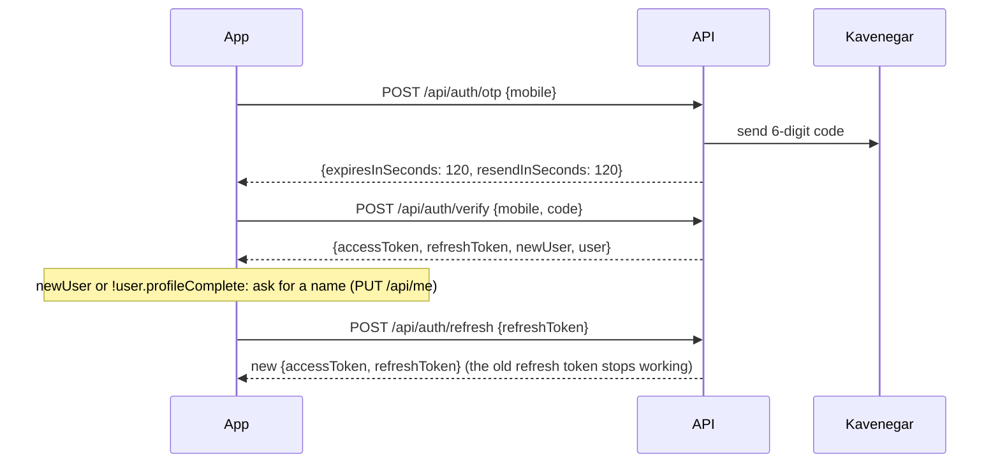
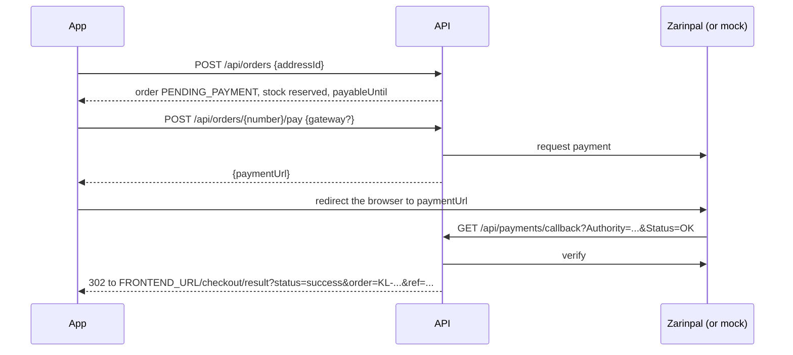

# API reference

The backend is a JSON REST API under `/api`. The interactive version of this document is served
by the running app at `/swagger-ui.html` (OpenAPI JSON at `/v3/api-docs`).

## Conventions

- **Money** is whole Rials (`long`). Show Toman in the UI: `rial / 10`.
- **Time** is UTC ISO-8601 (`2026-10-01T10:00:00Z`). Show it in the Jalali calendar.
- **Auth**: send `Authorization: Bearer <accessToken>`. Access tokens last 15 minutes; use the
  refresh token to get a new pair.
- **Input** is normalised: Arabic ي/ك become Persian ی/ک, Persian digits are accepted in mobile
  numbers, postal codes and codes, and mobiles may be written `0912...`, `912...`, `+98912...`.
- **Paging**: `?page=0&size=20` (size at most 50). Paged responses look like
  `{"items": [...], "page": 0, "size": 20, "totalItems": 42, "totalPages": 3}`.
- **Errors** use RFC 9457 problem details with a stable `code` and a Persian `detail` that can be
  shown as is. Validation errors add a per-field `errors` map; rate limits add
  `retryAfterSeconds` and a `Retry-After` header.

```json
{
  "status": 400,
  "code": "VALIDATION_FAILED",
  "detail": "اطلاعات ارسال‌شده معتبر نیست.",
  "errors": { "postalCode": "کد پستی را وارد کنید." }
}
```

## Sign-in



| Method | Path | Auth | Purpose |
| --- | --- | --- | --- |
| POST | `/api/auth/otp` | - | Send a login code. One per 2 minutes and 5 per hour per number; 20 per 10 minutes per client IP. |
| POST | `/api/auth/verify` | - | Check the code (5 attempts) and sign in; creates the account on first sign-in. |
| POST | `/api/auth/refresh` | - | Rotate the refresh token. Reusing an old one signs the user out everywhere (see below). |
| POST | `/api/auth/logout` | - | Revoke a refresh token. |

Refresh tokens are single-use. If two tabs refresh with the same token at once, the second gets
401 `INVALID_REFRESH_TOKEN` and should pick up the tokens the first tab stored; nothing else
happens. Reusing a token more than 30 seconds after it was replaced is treated as theft and
revokes all of the user's sessions. The simplest client pattern is to share one in-flight refresh
between tabs and requests.

In development the code is printed in the backend log. With `OTP_DEMO_MODE=true` it is also
returned as `demoCode` (for a public demo without SMS; never with a real SMS provider).

## Profile and addresses

| Method | Path | Auth | Purpose |
| --- | --- | --- | --- |
| GET | `/api/me` | user | Profile, including `profileComplete`. |
| PUT | `/api/me` | user | Set `firstName`, `lastName`, `email`. |
| GET | `/api/provinces` | - | The 31 provinces for the address form. |
| GET | `/api/me/addresses` | user | Addresses, default first. |
| POST | `/api/me/addresses` | user | Add one. The first address, or one sent with `makeDefault: true`, becomes the default. |
| PUT | `/api/me/addresses/{id}` | user | Edit. |
| POST | `/api/me/addresses/{id}/default` | user | Make it the default. |
| DELETE | `/api/me/addresses/{id}` | user | Delete; if it was the default, the newest remaining one takes over. |

## Catalog

| Method | Path | Auth | Purpose |
| --- | --- | --- | --- |
| GET | `/api/categories` | - | Category tree for the menu. |
| GET | `/api/categories/{slug}` | - | A category with breadcrumbs and subcategories. |
| GET | `/api/brands?category=` | - | Brands, optionally only those with products in a category (filter sidebar). |
| GET | `/api/products` | - | Search and filter, see below. |
| GET | `/api/products/{slug}` | - | Product page: variants, selectable options, specs, images, rating summary. |
| GET | `/api/products/{slug}/reviews` | - | Approved reviews, newest first. |

`GET /api/products` parameters, all optional:

| Parameter | Meaning |
| --- | --- |
| `q` | Words that must all appear in the product or brand name (up to 200 characters). Half-spaces and the digit script are ignored, so "تی شرت" finds "تی‌شرت" and "65" finds "۶۵". |
| `category` | Category slug; subcategories are included. |
| `brand` | Brand slug; repeat for several (`brand=a&brand=b`). |
| `minPrice`, `maxPrice` | Rial, compared with the price shown on the card. |
| `inStock=true` | Hide sold-out products (they are listed last anyway). |
| `offers=true` | Only products with a running amazing offer (شگفت‌انگیز). |
| `sort` | `newest` (default), `cheapest`, `most-expensive`, `biggest-discount`, `top-rated`, `bestselling`. |

A product card shows its cheapest in-stock variant: `price`, `originalPrice` (crossed out),
`discountPercent`, `offerEndsAt` (countdown), `inStock`, `rating`, `reviewCount`. On the product
page each variant has the same price fields, plus `remaining` when five or fewer are left.

## Cart

All cart endpoints need a signed-in user and return the whole cart.

| Method | Path | Purpose |
| --- | --- | --- |
| GET | `/api/cart` | The cart at current prices. |
| POST | `/api/cart/items` | `{variantId, quantity}`; adding a variant again increases its quantity. |
| PUT | `/api/cart/items/{variantId}` | `{quantity}`; 0 removes it. |
| DELETE | `/api/cart/items/{variantId}` | Remove one variant. |
| DELETE | `/api/cart` | Empty the cart. |
| POST | `/api/cart/merge` | `{items: [{variantId, quantity}]}`: add a guest cart after sign-in (caps quantities, skips sold-out items). |

The cart response has `lines` (each with `maxQuantity` and an `issue` of `UNAVAILABLE`,
`OUT_OF_STOCK` or `INSUFFICIENT_STOCK` when something changed), `itemsTotal`, `discountTotal`,
`shippingFee`, `freeShippingRemaining` ("add X more for free shipping"), `payable` and
`hasIssues`. Shipping is a flat 60,000 Toman, free from 1,000,000 Toman (both configurable). At
most 10 of one variant and 50 different variants per cart.

## Orders and payment



| Method | Path | Auth | Purpose |
| --- | --- | --- | --- |
| POST | `/api/orders` | user | Checkout: `{addressId, expectedPayable}`. Refused while the cart has issues, or with `PRICES_CHANGED` when `expectedPayable` (the cart's `payable` the customer saw) no longer matches. |
| GET | `/api/orders` | user | Order history, newest first, with up to four item images each. |
| GET | `/api/orders/{orderNumber}` | user | Order details, items, address snapshot and payment attempts. |
| POST | `/api/orders/{orderNumber}/cancel` | user | Cancel while unpaid; the stock is released. |
| POST | `/api/orders/{orderNumber}/pay` | user | Start a payment attempt: `{gateway: "ZARINPAL" or "MOCK"}` (optional). |
| GET | `/api/payments/callback` | - | Gateway return URL. Safe to call again: a finished payment is only reported. |
| GET | `/api/payments/mock/{authority}` | - | The mock gateway's page (development and demos only). |

An order with nothing to pay (free items and free shipping) is PAID at checkout. If two customers
race for the last unit, or anything else changes concurrently, the loser gets 409
`CONCURRENT_UPDATE` and can simply retry.

The result page reads `status` (`success` or `failed`), `order` and, on success, `ref` (the
tracking code, کد پیگیری). A failed or cancelled payment leaves the order unpaid, so the customer
can try again until `payableUntil` (30 minutes after checkout).

## Reviews

| Method | Path | Auth | Purpose |
| --- | --- | --- | --- |
| POST | `/api/products/{slug}/reviews` | user | `{rating 1-5, title?, comment?, recommended?}`. One per product; waits for moderation. |
| GET | `/api/me/reviews` | user | The user's reviews with their status. |
| PUT | `/api/me/reviews/{id}` | user | Edit; goes back to moderation. |
| DELETE | `/api/me/reviews/{id}` | user | Delete. |

`verifiedPurchase` is true when the user has a delivered order with that product.

## Admin

Everything under `/api/admin` needs the `ADMIN` role. Mobile numbers listed in `ADMIN_MOBILES`
become admins when they sign in.

| Method | Path | Purpose |
| --- | --- | --- |
| POST, PUT, DELETE | `/api/admin/categories[/{id}]` | Manage categories (a category with children or products cannot be deleted). |
| POST, PUT, DELETE | `/api/admin/brands[/{id}]` | Manage brands (products of a deleted brand keep existing without one). |
| GET | `/api/admin/products?q=&active=` | All products, including inactive ones. |
| GET | `/api/admin/products/{id}` | Full product with stock levels and variant versions. |
| POST | `/api/admin/products` | Create a product with variants, specs and images in one request. |
| PUT | `/api/admin/products/{id}` | Edit product fields; `active: false` hides it from the store. |
| PUT | `/api/admin/products/{id}/specs` | Replace the spec table. |
| POST, DELETE | `/api/admin/products/{id}/images[/{imageId}]` | Add an image URL or remove an image. |
| POST | `/api/admin/products/{id}/variants` | Add a variant. |
| PUT | `/api/admin/variants/{id}` | Change a variant's SKU, attributes, prices, offer end, stock or `active`. Send the `version` from the product detail: if the variant changed meanwhile (for example it sold), the update is refused with `STALE_VARIANT` instead of overwriting the stock. |
| GET | `/api/admin/variants/low-stock?threshold=5` | Variants that are running out. |
| GET | `/api/admin/orders?status=&q=` | Orders; `q` is an order number or customer mobile. |
| GET | `/api/admin/orders/{orderNumber}` | One order, with the customer. |
| PATCH | `/api/admin/orders/{orderNumber}/status` | `{status}`: PAID to SHIPPED to DELIVERED, CANCELLED while unpaid, or REFUNDED (recorded only; the money is returned outside the system). |
| GET | `/api/admin/reviews?status=PENDING` | Moderation queue. |
| PATCH | `/api/admin/reviews/{id}` | `{status: "APPROVED" or "REJECTED"}`. |
| GET | `/api/admin/users?q=&role=` | Users by mobile or name. |
| PATCH | `/api/admin/users/{id}` | `{role?, active?}`. Deactivating signs the user out (after at most 15 minutes). |

## Error codes

Common `code` values: `VALIDATION_FAILED`, `INVALID_BODY`, `INVALID_PARAMETER`, `REQUEST_REJECTED`
(unknown path, wrong method...), `UNAUTHENTICATED`, `FORBIDDEN`,
`INVALID_MOBILE`, `OTP_RESEND_TOO_SOON`, `OTP_HOURLY_LIMIT`, `OTP_IP_LIMIT`, `OTP_INVALID`, `OTP_EXPIRED`,
`OTP_TOO_MANY_ATTEMPTS`, `ACCOUNT_DISABLED`, `INVALID_REFRESH_TOKEN`, `PRODUCT_NOT_FOUND`,
`VARIANT_UNAVAILABLE`, `QUANTITY_LIMIT`, `CART_FULL`, `CART_EMPTY`, `CART_HAS_ISSUES`,
`PRICES_CHANGED`, `CONCURRENT_UPDATE` (retry), `STALE_VARIANT`, `ORDER_NOT_FOUND`, `ORDER_NOT_CANCELLABLE`, `ORDER_NOT_PAYABLE`, `ORDER_EXPIRED`,
`GATEWAY_UNAVAILABLE`, `PAYMENT_GATEWAY_ERROR`, `REVIEW_EXISTS`, `INVALID_STATUS_CHANGE`,
`CONSTRAINT_VIOLATION`.
