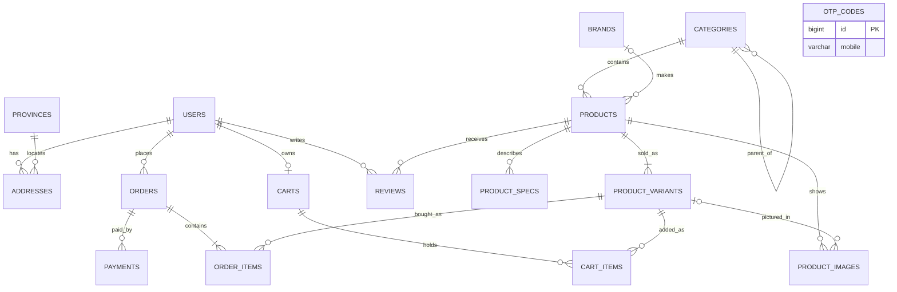
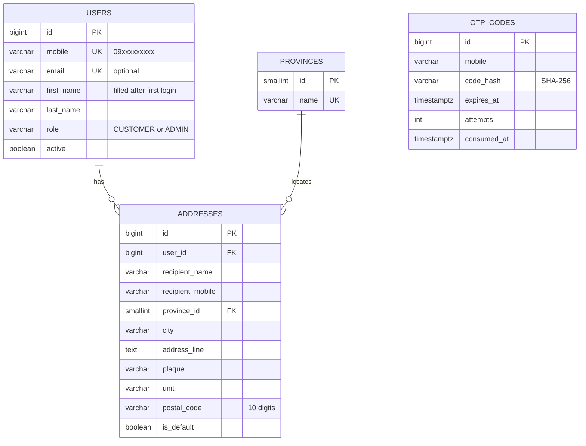
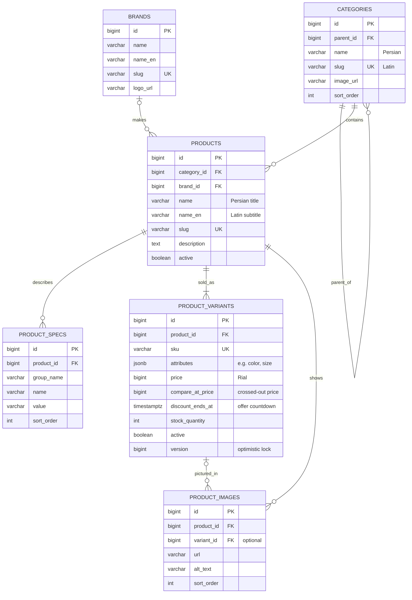
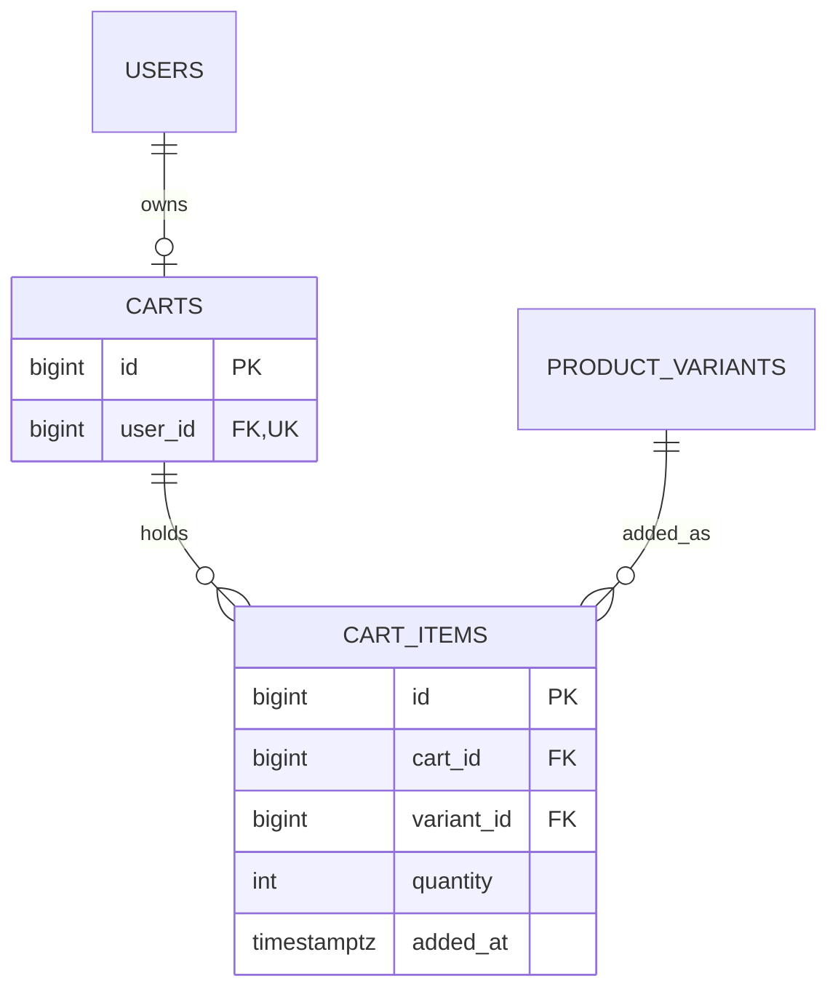
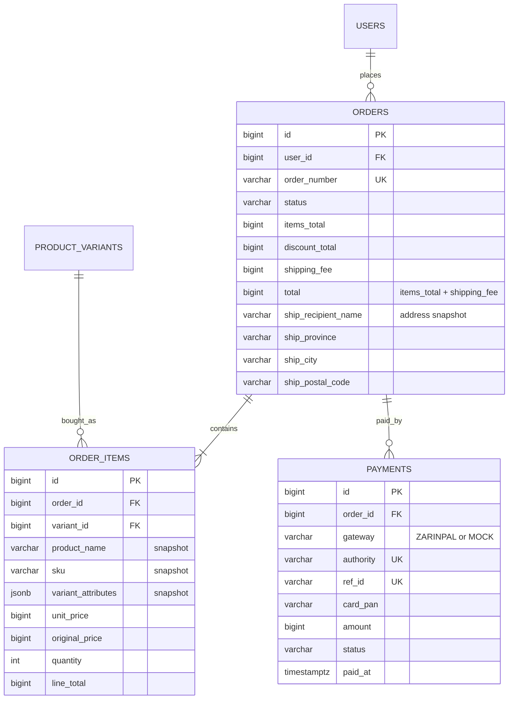
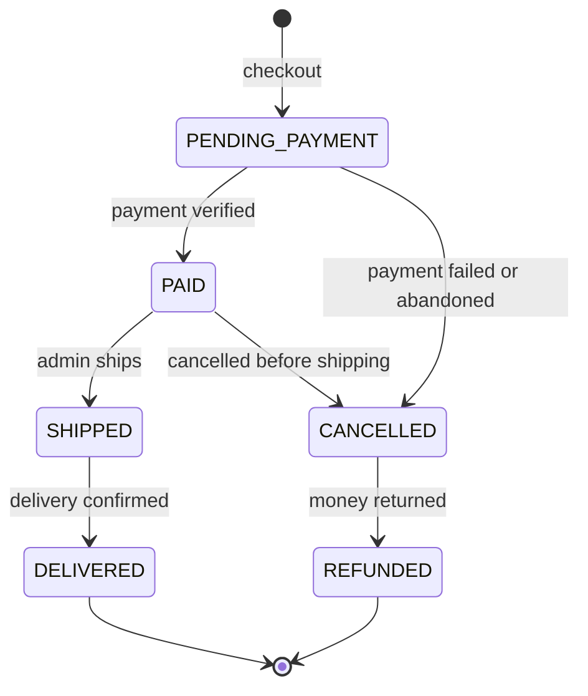
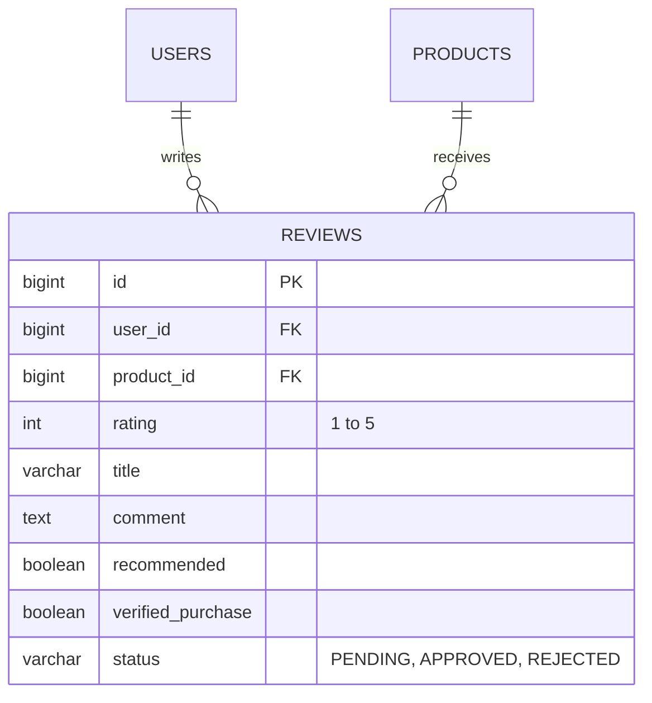

# Database design

Kalamet's schema has 16 tables in 5 layers. Each layer depends only on the ones above it, and
each maps to one Flyway migration in `backend/src/main/resources/db/migration` and one Java
package. The migrations are the source of truth; this document explains them.

| Layer | Migration | Tables | Package |
| --- | --- | --- | --- |
| 1. Identity | `V1__identity.sql` | users, otp_codes, provinces, addresses | `user` |
| 2. Catalog | `V2__catalog.sql` | categories, brands, products, product_specs, product_variants, product_images | `catalog` |
| 3. Shopping cart | `V3__cart.sql` | carts, cart_items | `cart` |
| 4. Orders and payments | `V4__orders.sql` | orders, order_items, payments | `order` |
| 5. Engagement | `V5__engagement.sql` | reviews | `review` |

Conventions used everywhere: money is whole Rials (`BIGINT`, Java `long`) and shown as Toman
(Rial / 10); timestamps are `TIMESTAMPTZ` in UTC (Java `Instant`) and shown in the Jalali calendar;
enums are `VARCHAR` with a `CHECK` constraint (`@Enumerated(EnumType.STRING)`); ids are
`BIGINT GENERATED BY DEFAULT AS IDENTITY`.

## Full ERD

`otp_codes` has no foreign keys on purpose: a code can be requested for a number that has no
account yet. The user row is created on the first successful verification.

## Layer 1: Identity

- Login is mobile number plus a one-time SMS code; there are no passwords. Only a hash of each
  code is stored, with an expiry and an attempt counter to stop brute-forcing.
- A partial unique index allows at most one default address per user.
- Orders copy the address as text at checkout, so addresses can be edited or deleted freely.

## Layer 2: Catalog

- A product is the shared description; a variant is what is actually sold. A product without
  options has one variant with `attributes = {}`. Attribute keys are English, values Persian.
- The database rejects a `compare_at_price` that is not higher than `price`, and a
  `discount_ends_at` without a `compare_at_price`.
- `version` makes concurrent stock updates safe: one checkout gets an optimistic-lock error and
  retries instead of overselling.
- Products and variants are never hard-deleted once sold (order items reference variants); set
  `active = false` instead.

## Layer 3: Shopping cart

- One persistent cart per user (`UNIQUE user_id`), created lazily on first add-to-cart.
- `UNIQUE (cart_id, variant_id)`: adding the same variant again increases the quantity.
- Cart items store no price, so the cart always shows current prices. Stock is checked on add
  and again at checkout, where it is decremented.

## Layer 4: Orders and payments

(The `ship_*` snapshot also includes recipient mobile, address line, plaque and unit.)

Order status lifecycle:

- Orders are financial records: users with orders cannot be deleted (`ON DELETE RESTRICT`).
- The database checks `total = items_total + shipping_fee` and
  `line_total = unit_price * quantity`.
- Payments keep one row per attempt, following Zarinpal's flow: request an `authority`, redirect
  the customer, verify, store `ref_id`. Unique `authority` and `ref_id` make callback handling
  idempotent.
- Checkout runs in one transaction: check stock, decrement it, create the order and items,
  empty the cart. Cancelling restores stock.

## Layer 5: Engagement

- One review per user per product (`UNIQUE (user_id, product_id)`); only APPROVED reviews are
  shown.
- `verified_purchase` is set by the service when the user has a DELIVERED order with that product.

## Delete behaviour

| Parent → child | On parent delete |
| --- | --- |
| users → addresses, carts, reviews | Cascade |
| users → orders | Restrict |
| provinces → addresses | Restrict |
| categories → categories, products | Restrict |
| brands → products | Set null |
| products → specs, variants, images, reviews | Cascade (blocked in practice once a variant is sold) |
| product_variants → product_images | Set null |
| product_variants → cart_items | Cascade |
| product_variants → order_items | Restrict |
| carts → cart_items, orders → order_items | Cascade |
| orders → payments | Restrict |

## Planned extensions

Product Q&A, wishlists, coupons, Persian full-text search (e.g. `pg_trgm`), and refresh-token
storage for JWT auth.
